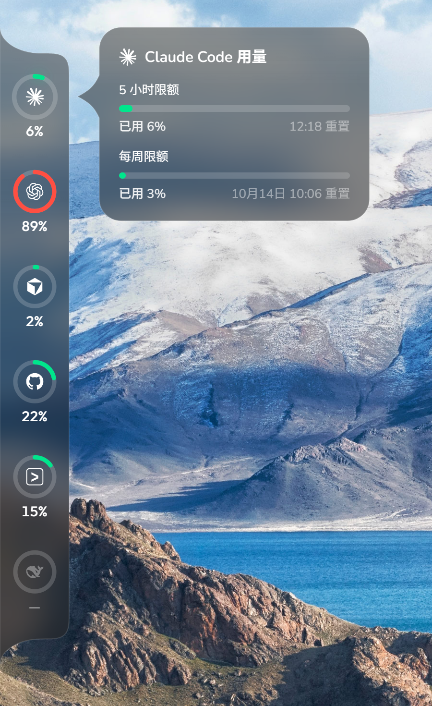
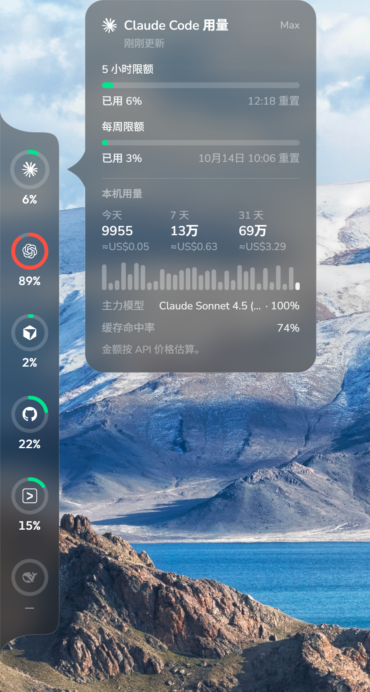
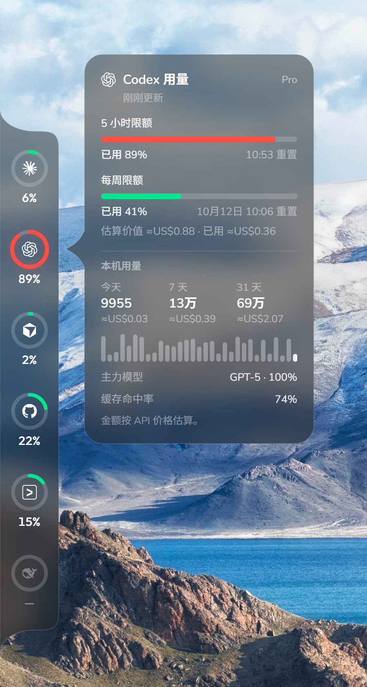
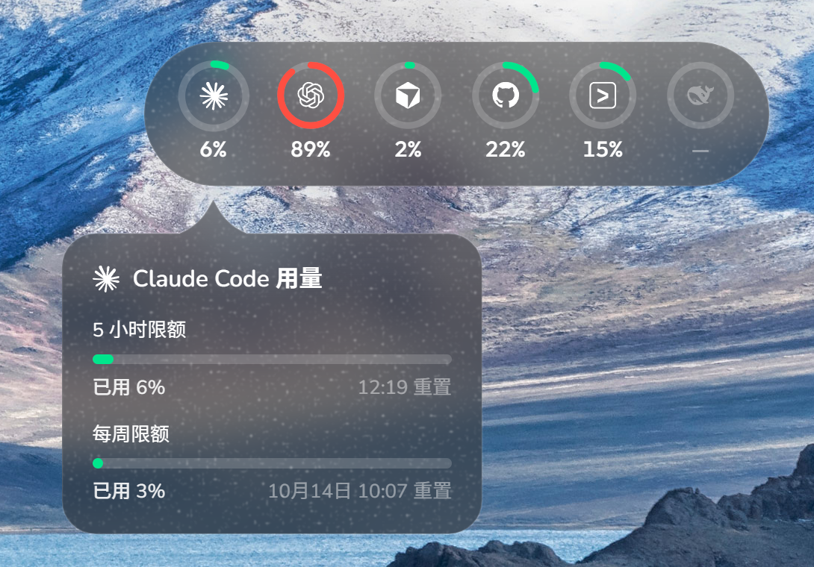
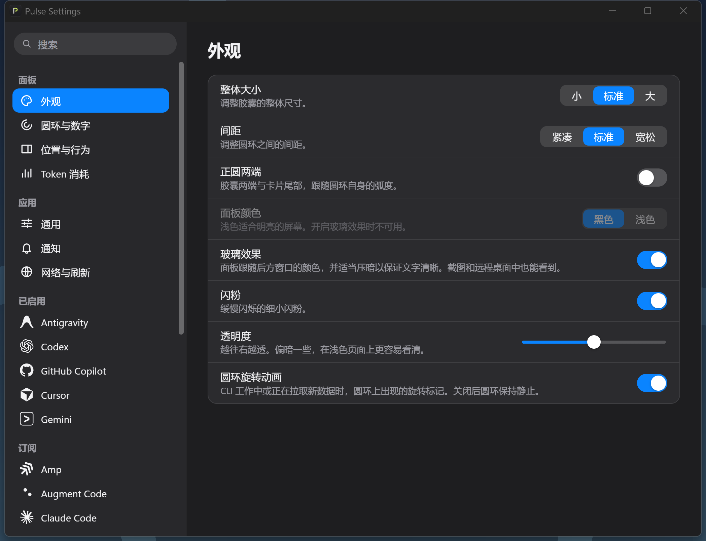

<div align="center">


# Pulse for Windows

**把 AI 编程工具的额度、重置时间和 Token 消耗放在屏幕边缘。**

A Windows desktop monitor for AI coding plan limits, token usage and estimated spend.

[](https://github.com/FHfanshu/Pulse-Windows/actions/workflows/ci.yml)
[](https://github.com/FHfanshu/Pulse-Windows/releases)
[](LICENSE)


[下载 / Releases](https://github.com/FHfanshu/Pulse-Windows/releases) · [反馈问题](https://github.com/FHfanshu/Pulse-Windows/issues) · [上游 Pulse](https://github.com/qunqin24/Pulse)

</div>

## 简介

Pulse for Windows 是 [qunqin24/Pulse](https://github.com/qunqin24/Pulse) 的 Windows 移植版。使用多个 AI 编程工具时，你可以通过常驻屏幕边缘的额度圆环，查看各账号已用比例；悬停打开详情卡片，查看不同额度窗口、重置时间、余额及可用的本地消耗记录。

项目使用 **Rust + Tauri 2 + React + TypeScript**，保留上游的交互与视觉思路，接入 Windows 托盘、窗口管理和凭据加密。目前版本为 **0.1.2**，仍在持续完善；各服务的可用信息取决于账号权限、认证方式和服务接口。

## 功能

- **额度浮窗**：多账号圆环、悬停详情、屏幕边缘吸附、自动收起、全屏隐藏和多显示器设置。
- **Windows 托盘**：在托盘显示额度，打开账号概览、设置或手动刷新；支持开机启动与全局快捷键。
- **账号与额度**：读取支持服务的套餐窗口、重置时间和余额；部分服务支持多个账号。
- **Token 消耗分析**：读取本机工具日志，按工具、模型、日期、项目和会话查看消耗，区分输入、输出及缓存 Token。
- **费用估算与回顾**：结合模型价格展示可估算的花费，生成使用回顾，并提供导出界面。估算结果不是服务商账单。
- **提醒与网络设置**：额度提醒、刷新频率调整，以及 HTTP / SOCKS5 代理配置。
- **五种界面语言**：简体中文、繁體中文、English、日本語、한국어。
- **Windows 凭据保护**：Pulse 保存的密钥由当前 Windows 用户的 DPAPI 加密。

## 支持范围

### 账号额度与余额

可连接以下服务；额度、重置时间和余额等信息因服务、套餐及登录方式而异。

| 类型 | 服务 |
| --- | --- |
| 编程工具与订阅 | Claude Code、Codex、Cursor、GitHub Copilot、Antigravity、Kiro、Gemini、Windsurf、Amp、Augment Code、Factory、Warp |
| 编程套餐与模型服务 | OpenCode Go、Kimi Code、Z.ai、MiniMax、Grok、DeepSeek、Moonshot、OpenAI API |

### 本机 Token 记录

本机 Token 统计来自工具日志，与服务端额度独立。可读取以下工具的记录：

- Claude Code、Codex、OpenCode、Kilo CLI、Grok、Kimi CLI、Devin CLI。
- Pi、Oh My Pi、Senpi、Kimchi、Prime Agent、Gemini CLI、Qwen Code、Amp、Factory Droid、OpenClaw。
- Roo Code、Kilo Code、Cline、CodeBuddy、WorkBuddy、Cherry Studio、Command Code、OpenCode Review、Z Code。
- Hermes、Goose、Zed、Kiro、Crush、Unsloth、Antigravity CLI / IDE、Micode、Devin Desktop。
- Mux、Codebuff、Freebuff、JCode、Augment、GJC、Junie、DSH、FX、LM Studio、Reasonix。
- Cursor、Antigravity 导出、Trae、Warp、Hindsight、MiniMax Code、GitHub Copilot；其中部分来源需要工具导出或采集文件。

不同工具记录的字段不同，可提供的统计信息也有所差异。缺失日志、未记录模型或未提供缓存计数时，统计可能不完整；没有可用价格的模型无法可靠估算费用。

## 界面截图

以下截图来自 Windows 版实际运行界面，使用演示数据，不包含真实账号信息。点击图片可查看原图。

<table>
  <tr>
    <td align="center" valign="top" width="33%">
      <a href="docs/screenshots/windows-sidebar-glass.png"></a>
      <br /><sub><b>侧边面板与亚克力效果</b></sub>
    </td>
    <td align="center" valign="top" width="33%">
      <a href="docs/screenshots/windows-detail-claude.png"></a>
      <br /><sub><b>详细用量卡片 · Claude Code</b></sub>
    </td>
    <td align="center" valign="top" width="33%">
      <a href="docs/screenshots/windows-detail-codex.png"></a>
      <br /><sub><b>详细用量卡片 · Codex</b></sub>
    </td>
  </tr>
</table>

- **侧边面板与亚克力效果**：面板贴靠屏幕边缘，悬停圆环可展开额度详情。原生亚克力效果让面板与卡片透出背景颜色，并对背景进行模糊处理。
- **详细用量卡片**：显示套餐、额度用量和重置时间；开启本机 Token 统计后，可查看今日、近 7 天和近 31 天用量、每日趋势、主要模型与缓存命中率。费用按 API 价格估算，不代表实际账单。

<table>
  <tr>
    <td align="center" valign="top" width="50%">
      <a href="docs/screenshots/windows-panel.png"></a>
      <br /><sub><b>横向浮动面板</b>：面板可横向悬浮，支持显示额度百分比和闪粉效果。</sub>
    </td>
    <td align="center" valign="top" width="50%">
      <a href="docs/screenshots/windows-settings.png"></a>
      <br /><sub><b>外观设置</b>：调整面板大小、圆环间距、亚克力效果、闪粉和透明度。</sub>
    </td>
  </tr>
</table>

## 下载与安装

支持 **Windows 10 / 11 x64**，需要 Microsoft Edge WebView2 Runtime。

1. 打开 [Releases](https://github.com/FHfanshu/Pulse-Windows/releases)，下载已发布版本的 `Pulse_<版本>_x64-setup.exe`。
2. 运行安装程序并启动 Pulse。如果系统缺少 WebView2，安装程序会尝试联网安装运行时。
3. 从托盘菜单打开设置，启用需要的账号，并按各账号页面要求连接服务。
4. 在面板、外观、提醒和网络页面调整位置、显示方式与刷新策略。

也可下载 `Pulse_<版本>_windows-x64.zip`，解压后运行 `pulse.exe`。免安装包同样依赖 WebView2，并使用相同的数据目录。

安装包尚未提供 Windows 代码签名，系统可能显示 SmartScreen 提示。发布文件附带 `SHA256SUMS.txt`，可用 PowerShell 核对文件：

```powershell
Get-FileHash .\Pulse_0.1.2_x64-setup.exe -Algorithm SHA256
```

### 数据与隐私

Pulse 的设置、凭据和缓存保存在 `%APPDATA%\Pulse`。本地消耗分析读取工具在本机保存的记录；账号刷新会访问对应服务，模型价格获取也可能访问网络。DPAPI 加密不覆盖所有缓存、项目名称和会话标题；分享诊断信息前请移除个人信息与密钥。

## 从源码运行

准备环境：

- Windows 10 / 11 x64 与 WebView2 Runtime。
- Node.js **22 LTS** 与 npm（CI 使用 Node 22）。
- Rust stable，`x86_64-pc-windows-msvc` 工具链。
- Visual Studio 2022 Build Tools：安装「使用 C++ 的桌面开发」与 Windows SDK。

```powershell
git clone https://github.com/FHfanshu/Pulse-Windows.git
cd Pulse-Windows
npm ci
npm run tauri dev
```

开发时推荐运行 `npm run tauri:dev`：它会选择空闲端口（1420 被另一个开发实例占用时也能启动），并同步设置 Vite 端口与 Tauri 页面地址，不复用其他工作树的前端。

开发版与已安装的正式版可以同时运行：`tauri:dev` 使用独立的应用标识（`app.pulse.windows.dev`），开发版的数据放在 `%APPDATA%\Pulse Dev`（首次启动时从 `%APPDATA%\Pulse` 复制一份设置与账号，之后互不影响），也不会改动开机自启项。直接运行 `npm run tauri dev` 时，若正式版正在运行，启动会被交给正式版。

使用样例读数预览界面：

```powershell
$env:PULSE_MOCK = "1"
npm run tauri dev
# 结束后清除当前终端的样例模式
Remove-Item Env:PULSE_MOCK
```

### 检查与打包

```powershell
npm run build
cargo test --workspace --all-targets --locked
npm run tauri build -- --target x86_64-pc-windows-msvc -- --locked
pwsh -File scripts/package-windows.ps1
```

安装包位于 `target/x86_64-pc-windows-msvc/release/bundle/nsis/`；最后一步将安装包、免安装包和 SHA-256 校验表整理到 `release-artifacts/`。

## CI / CD

| 流程 | 触发条件 | 检查与产物 |
| --- | --- | --- |
| [CI](.github/workflows/ci.yml) | 推送到 `main`、Pull Request、手动运行 | 验证版本一致性 → `npm ci` → TypeScript / Vite 构建 → Rust workspace 测试 → Windows x64 NSIS 安装包与免安装包 → SHA-256 → 上传 artifact |
| [Release](.github/workflows/release.yml) | 推送 `v*` 标签、手动运行 | 复用相同 CI 检查与打包流程（并为应用内更新签名安装包、生成 `latest.json`），成功后创建或更新 Release 草稿并上传全部发行文件 |

Actions 使用固定提交的第三方 action；普通 CI 只有读取仓库权限，发布任务单独申请 `contents: write`。构建不需要提供服务商账号、API Key 或自定义 GitHub Token。

维护者操作、版本规则和发布说明模板见 [发布指南](docs/RELEASING.md)。发行通过 GitHub Releases 分发；0.1.1 起，设置 → 关于 可检查并安装更新（默认每两小时检查一次，只提示，点击后才下载安装）。

## 项目结构

```text
crates/pulse-core/  Rust 核心：服务适配、额度、消耗统计、缓存、认证与提醒
src-tauri/         Tauri / Win32：窗口、托盘、IPC、安装包
ui/                React + TypeScript：浮窗、设置、仪表盘与使用回顾
locales/           五种语言的 JSON 翻译
assets/            应用与服务图标
scripts/           本地化转换、版本检查与发行打包
.github/workflows/ CI 与 Release 流程
docs/              移植规格、来源接入指南与发布文档
```

欢迎提交问题和 Pull Request。反馈时请提供 Windows 版本、Pulse 版本、相关服务和复现步骤；涉及日志时先脱敏。新增来源可参考 [Token 消耗来源接入指南](docs/spend-source-brief.md)。[移植规格](docs/SPEC.md)保留了项目初期的设计与计划，当前实现以代码为准。

## 上游与许可

本项目基于 [qunqin24/Pulse](https://github.com/qunqin24/Pulse)，是独立维护的 Windows 移植版。感谢上游作者的产品设计、交互、翻译与服务适配工作。

代码采用 [Apache License 2.0](LICENSE)。来源说明见 [NOTICE](NOTICE)，第三方素材与上游许可记录见 [THIRD_PARTY_NOTICES.md](THIRD_PARTY_NOTICES.md)，依赖库的许可证全文见 [THIRD_PARTY_LICENSES.md](THIRD_PARTY_LICENSES.md)。服务名称和商标属于各自所有者。
